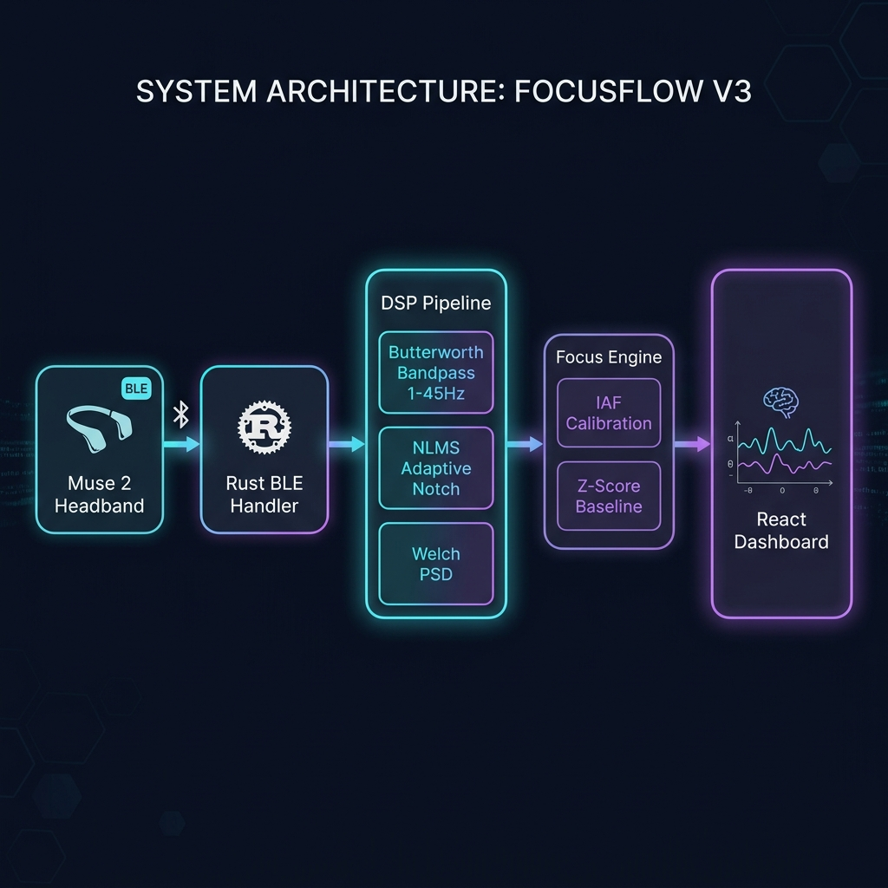

<div align="center">

# 🧠 FocusFlow V3

### Native Real-Time Brain-Computer Interface

*Bypassing proprietary SDKs to build real-time EEG processing from the bare metal*

[](https://github.com/chahat1709/focusflow)
[](https://www.rust-lang.org/)
[](https://python.org)
[](https://tauri.app/)

</div>

---

## ⚡ What is FocusFlow?

FocusFlow V3 is a **high-performance native desktop application** that reads, processes, and maps real-time brainwave data from a connected **Muse 2** EEG wearable — built entirely from scratch.

Instead of relying on the proprietary Muse SDK or third-party middleware, FocusFlow implements:
- **Custom BLE protocol handlers** in Rust for direct hardware communication
- **Full DSP pipeline** (Butterworth filters, NLMS adaptive notch, Welch PSD) from scratch
- **Real-time focus metric calibration** using Individual Alpha Frequency (IAF) and Z-score baselines

> **Built by a 17-year-old, entirely self-taught systems engineer.**

---

## 🔬 Research Context

| | |
|---|---|
| **Problem** | Existing BCI focus metrics experience >30% temporal drift over 20 minutes due to baseline environmental shifts and sensor fatigue |
| **Hypothesis** | Rolling baseline Z-score calibration + IAF filtering prevents temporal drift without exceeding a strict 50ms latency constraint |
| **Goal** | Achieve 20%+ accuracy retention in sustained focus state classification vs. default Muse SDK metrics |
| **Status** | Full DSP pipeline architected in Rust achieving sub-millisecond buffer execution. Currently tuning NLMS adaptive filters |

---

## 🏗️ Architecture & DSP Pipeline

<div align="center">



</div>

### Pipeline Stages

```
Muse 2 Headband (BLE)
    │
    ▼
┌─────────────────────────────────┐
│  1. RUST BLE HANDLER            │
│  • Raw multi-byte stream parse  │
│  • Muse 2 characteristic UUIDs  │
│  • 256Hz sample rate ingestion  │
└──────────────┬──────────────────┘
               │
               ▼
┌─────────────────────────────────┐
│  2. DSP PIPELINE (Rust)         │
│  • 4th-order cascaded biquad    │
│    Butterworth bandpass 1-45Hz  │
│  • NLMS Adaptive Notch filter   │
│    (50/60Hz mains suppression)  │
│  • Death-lock detection         │
└──────────────┬──────────────────┘
               │
               ▼
┌─────────────────────────────────┐
│  3. FEATURE EXTRACTION          │
│  • Welch PSD (Power Spectral    │
│    Density)                     │
│  • Theta/Alpha/Beta/Gamma       │
│    band ratio extraction        │
└──────────────┬──────────────────┘
               │
               ▼
┌─────────────────────────────────┐
│  4. FOCUS ENGINE                │
│  • IAF calibration per session  │
│  • Z-score baseline tracking    │
│  • Causal Beta/Theta ratio      │
│  • 1Hz throttle (no CPU flood)  │
└──────────────┬──────────────────┘
               │
               ▼
┌─────────────────────────────────┐
│  5. REACT DASHBOARD (Tauri)     │
│  • Real-time EEG waveforms      │
│  • Focus score visualization    │
│  • Session history & reports    │
│  • Sub-15ms DOM updates         │
└─────────────────────────────────┘
```

---

## 📂 Project Structure

```
FocusFlow_V3/
├── src-tauri/
│   └── src/
│       ├── lib.rs              # Tauri command handlers & app state
│       ├── hardware/
│       │   ├── mod.rs          # HeadsetProvider trait (hardware-agnostic)
│       │   ├── muse.rs         # Muse 2 BLE connector & packet parser
│       │   └── openbci.rs      # OpenBCI serial stub (extensible)
│       ├── dsp/
│       │   ├── mod.rs          # DSP orchestrator (process_chunk)
│       │   ├── filters.rs      # Butterworth bandpass & notch filters
│       │   ├── nlms.rs         # NLMS adaptive notch (death-lock safe)
│       │   ├── features.rs     # Welch PSD & band power extraction
│       │   ├── artifacts.rs    # Artifact rejection (blink, jaw clench)
│       │   └── sleep_pipeline.rs  # Sleep stage classification
│       ├── database/
│       │   ├── mod.rs          # Session storage
│       │   ├── schema.rs       # SQLite schema
│       │   └── sync.rs         # Data sync logic
│       └── screen_tracker.rs   # Active window tracking
├── production_server.py        # Python DSP server (V2 reference)
├── muse_ble.py                 # Python BLE handler (V2 reference)
├── dashboard.html              # Web dashboard (Three.js 3D viz)
└── test_dsp.py                 # DSP unit tests
```

---

## 🛠️ Tech Stack

| Layer | Technology | Purpose |
|-------|-----------|---------|
| **Systems Core** | Rust | BLE handlers, DSP filters, memory-safe buffers |
| **Native Shell** | Tauri | Desktop app with OS-level BLE access |
| **Frontend** | React / HTMX | Real-time dashboard with Three.js visualization |
| **DSP Math** | Custom Rust | Biquad cascades, FFT, NLMS adaptive filtering |
| **Hardware** | Muse 2 (BLE) | 4-channel EEG @ 256Hz |
| **Database** | SQLite | Local session persistence |
| **Reference Server** | Python | V2 DSP server (NumPy, SciPy) |

---

## 🚀 Quick Start

### Prerequisites
- **Rust** (latest stable via [rustup](https://rustup.rs/))
- **Node.js** 18+ (for frontend build)
- **Muse 2** headband with Bluetooth enabled
- **Python 3.10+** (optional, for reference DSP server)

### Setup

```bash
# Clone the repository
git clone https://github.com/chahat1709/focusflow.git
cd focusflow

# Install frontend dependencies
npm install

# Build and run the Tauri desktop app
cd FocusFlow_V3
cargo tauri dev
```

### Running the Python Reference Server (V2)

```bash
# Install Python dependencies
pip install -r production_requirements.txt

# Start the DSP production server
python production_server.py
```

---

## 📊 Key Metrics

| Metric | Value |
|--------|-------|
| EEG Sample Rate | 256 Hz |
| DSP Pipeline Target Latency | < 50ms |
| BLE Packet Size | 20 bytes → 12 samples |
| Filter Order | 4th-order Butterworth (cascaded biquad) |
| NLMS Harmonics | 6 |
| Throttle Rate | 1 Hz (focus metric output) |
| Rust Source Files | 17 |
| Rust Lines of Code | ~2,300 |

---

## 🧪 Testing

```bash
# Run Rust unit tests (DSP filters, NLMS kernel, BLE parser)
cd FocusFlow_V3/src-tauri
cargo test

# Run Python DSP tests
python test_dsp.py
python test_all.py
```

---

## 📝 License

This project is licensed under the terms in the [LICENSE](LICENSE) file.

---

<div align="center">

**Built with obsession by [Chahat Jain](https://github.com/chahat1709)**

*17-year-old self-taught systems engineer | India*

[LinkedIn](https://www.linkedin.com/in/chahat-jain-20873b377) · [GitHub](https://github.com/chahat1709) · [Email](mailto:chahatjain0-96@gmail.com)

</div>
